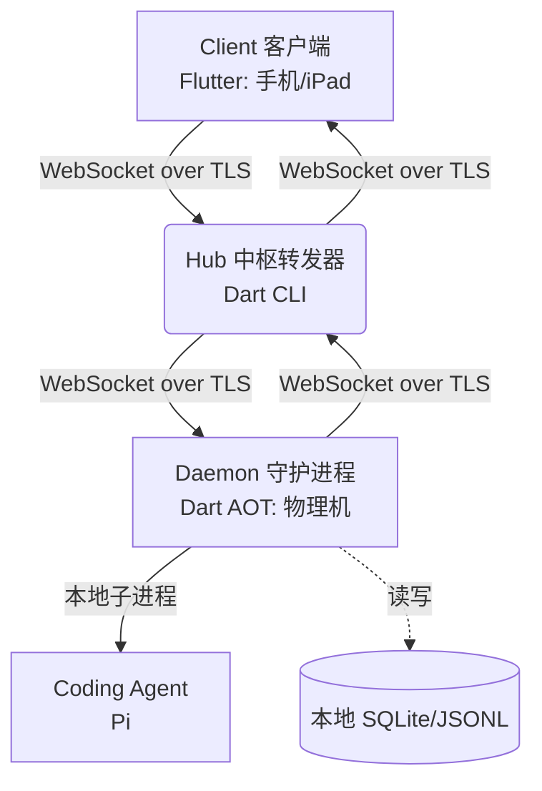

# MobilePi

**分布式 Coding Agent 移动端调度看板**

---

### 核心功能

MobilePi 允许开发者在通勤、会议或离开电脑时，通过手机或 iPad 远程监控并管控分布在多台物理开发机上的 Coding Agent（如 Pi）的工作流。

*   **远程状态掌控**：实时接收 Agent 的任务进度、运行日志摘要以及生成结果截图。
*   **节点决策纠偏**：通过自然语言下发纠偏指令，或通过预设按钮快速确认 Agent 的下一步规划。
*   **一键紧急干预**：支持一键强制终止（Panic Button）物理机上的 Agent 异常进程。
*   **本地数据主权**：代码和会话日志全部保留在物理开发机本地。中枢服务器（Hub）无状态，不存任何业务数据。
*   **轻量带宽设计**：默认仅同步状态摘要。截图、大日志或构建产物等富媒体文件仅在点击时按需拉取。

---

### 系统架构

系统由三端组成，采用基于 TLS 加密的 WebSocket 建立长连接，数据主权完全在物理开发机（Daemon）端：



*   **Client (`client/`)**：基于 Flutter (Android / iPadOS) 的控制台。提供基于状态的任务看板和对话流，渲染运行截图、日志摘要并下发用户决策。
*   **Hub (`hub/`)**：基于 Dart 的极简中转服务器。在内存中维护 Daemon 路由表，中转 Client 与 Daemon 的通信，并作为升级二进制包的静态托管宿主。
*   **Daemon (`node/`)**：在 macOS/Linux 物理开发机运行的 AOT 二进制进程。负责拉起 Agent 子进程、截取运行屏幕、持久化会话日志，并支持自动热更新。
*   **Shared (`shared/`)**：三端通用的通信协议和数据模型。

> **边界约束**：
> 1. **连接流向**：Daemon 主动连接并注册到 Hub。客户端仅读取中枢在线列表，不管理 Daemon 接入配置。
> 2. **差量同步**：重连时客户端通过 `last_msg_id` 向 Daemon 差量拉取缺失的运行日志，保证状态一致性。

---

### 看板与交互设计

*   **三态任务看板**：首页按 `Running`（运行中）、`Waiting`（等待决策）、`Idle`（空闲）分类展示任务，直观显示当前步骤进度和预计剩余时间。
*   **上下文按键 (Action Palette)**：根据 Agent 运行状态动态生成决策按钮（如报错时浮现 `[查看详细日志]`、`[换思路重试]`、`[回退上一提交]`）。
*   **生命指征状态灯 (Watchdog)**：红黄绿三态状态灯展示 Agent 状态：绿正常运行，黄等待用户输入，红代表死循环或严重报错。

---

### 快速开始

#### 开发环境一键启动（需安装 `just`）

在根目录下分终端执行：
```bash
just hub          # 启动中枢服务器
just daemon       # 启动本地守护进程并注册
just client-web   # 启动 Flutter Web 调试端
```

#### 手动分步启动

```bash
# 1. 启动 Hub
cd hub && dart pub get && dart run bin/hub.dart 8080

# 2. 启动 Daemon (物理机)
cd node && dart pub get && dart run bin/node.dart ws://localhost:8080/ws

# 3. 运行 Client
cd client && flutter pub get && flutter run -d web-server --web-hostname=127.0.0.1 --web-port=8082
```

#### 客户端构建（Android APK）
```bash
just android-arm64
# 或：cd client && flutter build apk --release --split-per-abi
```

---

### 技术选型

*   **全栈 Dart 链**：Client (Flutter) + Hub (Dart CLI) + Node (Dart AOT)，实现跨平台高效二进制复用与一致的序列化开销。
*   **WebSocket over TLS**：全程加密通信，通过 UUID 实现端对端精准消息路由。
*   **精简本地存储**：Daemon 端采用 SQLite + JSONL 流式日志扫描，保证海量历史对话在移动端秒级差量同步。
